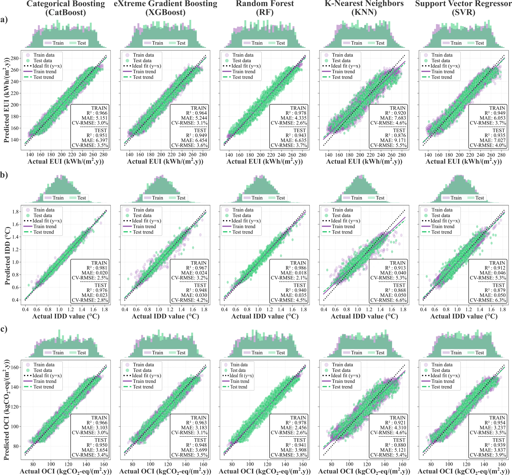
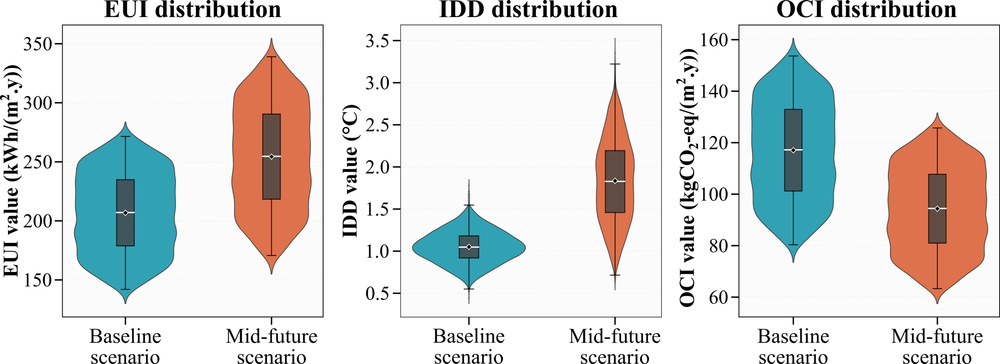
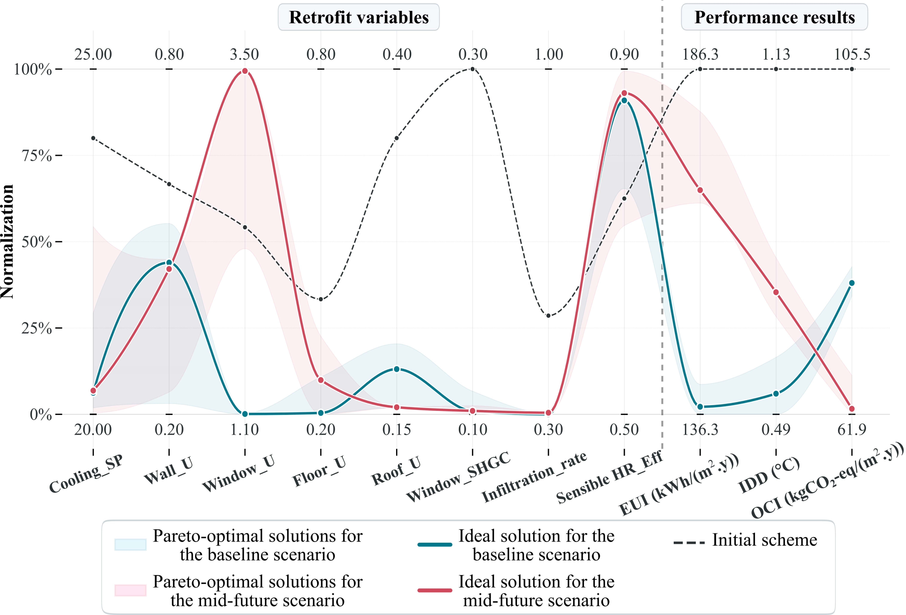
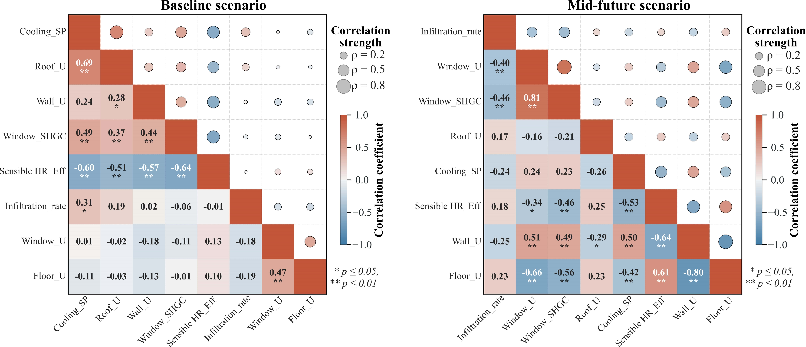

 # Multi-Objective Optimization of Building Energy Performance & Indoor Comfort

## 📌 Project Overview
This framework optimizes the trade-offs between **Energy Use Intensity (EUI)**, **Indoor Discomfort Degree (IDD)**, and **Operational Carbon Intensity (OCI)**. It compares a **Baseline scenario** with a **Mid-future climate scenario** using Bayesian-Optimized CatBoost and NSGA-II.

## 📊 1. Model Selection & Performance
We compared multiple ML architectures to find the best surrogate model. **CatBoost** showed superior performance in tracking targets across all objectives.

| Model Comparison | Actual vs. Predicted (CatBoost) |
|:---:|:---:|
|  |  |
| *Comparison of EUI, IDD, and OCI across models* | *Sensitivity analysis and RMSE highlights* |

### 🚀 BO-CatBoost Metrics
The performance of the Bayesian-Optimized CatBoost model for both scenarios:

---

## 🔍 2. Interpretability & Feature Importance (SHAP)
Using SHAP (SHapley Additive exPlanations), we analyzed how each input parameter influences the model's predictions.

*Red indicates high feature values; blue indicates low. Position on the X-axis shows the impact on the prediction.*

---

## 🎯 3. Optimization Results (NSGA-II)

### Solution Distribution
The density and dispersion of non-dominated solutions for EUI, IDD, and OCI:

### Pareto Front & Trade-offs
*(Note: Please ensure parallel_coordinates is uploaded to the results folder)*

*Dark lines represent ideal solutions; the dotted line marks the baseline scheme.*

---

## 📉 4. Correlation Analysis
Spearman correlation heatmap visualizing the relationships between retrofit variables:

---

## 📁 Repository Structure
* `notebooks/`: Main pipeline for training and optimization.
* `data/`: Historical and future climate datasets.
* `results/`: All generated plots and visual analysis.

## 🚀 Installation & Usage
1. `pip install -r requirements.txt`
2. Run `notebooks/building_energy_optimization.ipynb`
